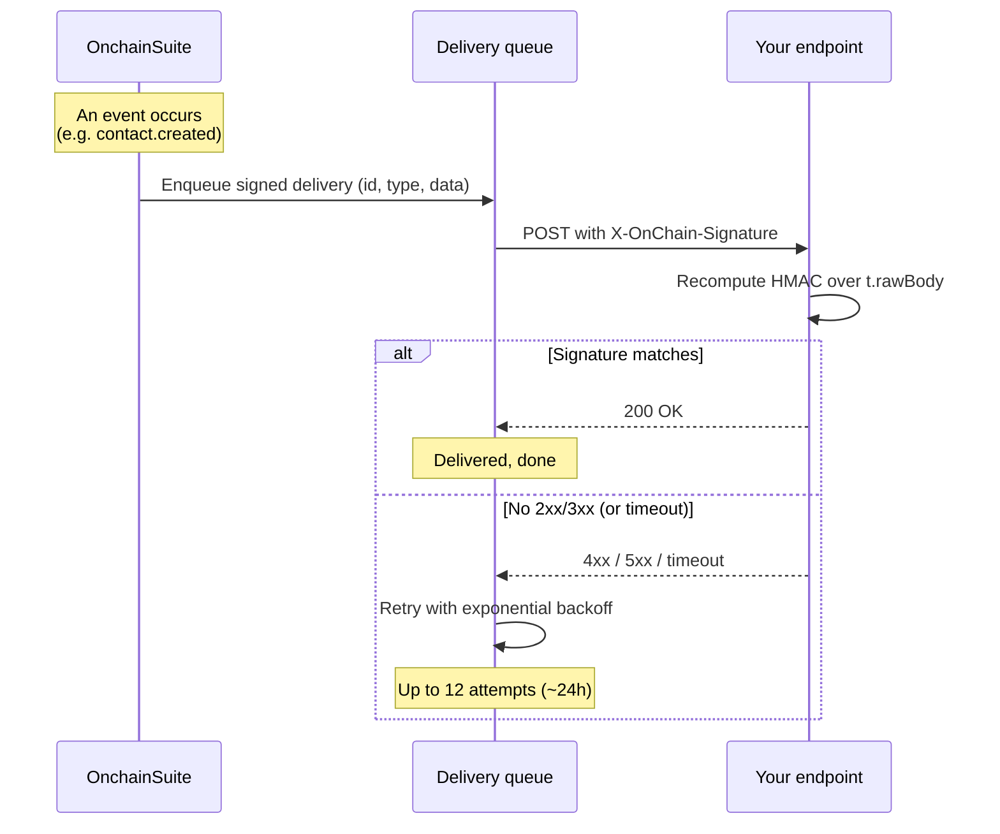

Webhooks push platform events to your server the moment they happen, a message is delivered, a contact is created, an automation completes, so your backend can react without polling. This guide is the **receive** side: subscribe, verify the signature, return `200`.

<Note>
**In plain terms.** Instead of your server constantly asking "anything new?", Onchain Suite calls your server the moment something happens, more like a doorbell than checking the door every minute. Your job is to answer, confirm it's really us (the signature check), and reply `200`.
</Note>

<Note>
This is the inverse of [custom events](/integrations/custom-events). Custom events go **from** your product **into** the platform; webhooks come **from** the platform **to** your endpoint.
</Note>

## Quickstart

Verify every delivery in a few lines. The signature is an HMAC-SHA256 of `timestamp.rawBody`, keyed with the `whsec_…` secret shown once when you create the endpoint.

<CodeGroup>
```js Node (Express)
import express from "express";
import crypto from "crypto";

const app = express();
const SECRET = process.env.ONCHAIN_WEBHOOK_SECRET; // "whsec_…"

// Capture the RAW body: signature is over the exact bytes we send.
app.post(
  "/hooks/onchainsuite",
  express.raw({ type: "application/json" }),
  (req, res) => {
    const sig = req.get("X-OnChain-Signature") || "";
    const parts = Object.fromEntries(
      sig.split(",").map((kv) => kv.split("=").map((s) => s.trim())),
    );
    const { t, v1 } = parts;
    if (!t || !v1) return res.status(400).send("missing signature");

    const raw = req.body.toString("utf8");
    const expected = crypto
      .createHmac("sha256", SECRET)
      .update(`${t}.${raw}`)
      .digest("hex");

    const a = Buffer.from(expected);
    const b = Buffer.from(v1);
    if (a.length !== b.length || !crypto.timingSafeEqual(a, b)) {
      return res.status(400).send("bad signature");
    }
    // Optional replay guard: t is Unix SECONDS.
    if (Math.abs(Math.floor(Date.now() / 1000) - Number(t)) > 300) {
      return res.status(400).send("stale timestamp");
    }

    const event = JSON.parse(raw); // { id, type, createdAt, data }
    // Dedupe on event.id (== X-OnChain-Delivery) before doing work.
    console.log(event.type, event.data);

    res.status(200).send("ok"); // any 2xx/3xx = success
  },
);

app.listen(3000);
```

```python Python (Flask)
import hmac, hashlib, time, os
from flask import Flask, request, abort

app = Flask(__name__)
SECRET = os.environ["ONCHAIN_WEBHOOK_SECRET"].encode()  # b"whsec_…"

@app.post("/hooks/onchainsuite")
def hook():
    sig = request.headers.get("X-OnChain-Signature", "")
    parts = dict(kv.strip().split("=", 1) for kv in sig.split(",") if "=" in kv)
    t, v1 = parts.get("t"), parts.get("v1")
    if not t or not v1:
        abort(400)

    raw = request.get_data()  # raw bytes, exactly as delivered
    expected = hmac.new(SECRET, f"{t}.".encode() + raw, hashlib.sha256).hexdigest()
    if not hmac.compare_digest(expected, v1):
        abort(400)
    if abs(int(time.time()) - int(t)) > 300:   # t is Unix seconds
        abort(400)

    event = request.get_json()  # { id, type, createdAt, data }
    # Dedupe on event["id"] before doing work.
    return "ok", 200
```

```ts Next.js (App Router)
// app/api/webhooks/onchain/route.ts
import { NextRequest, NextResponse } from "next/server";
import crypto from "crypto";

export const runtime = "nodejs";        // Node crypto + raw body, not the edge runtime
export const dynamic = "force-dynamic"; // never cache a webhook

const SECRET = process.env.ONCHAIN_WEBHOOK_SECRET!; // whsec_…

function verify(header: string | null, raw: string): boolean {
  if (!header) return false;
  const parts = Object.fromEntries(header.split(",").map((kv) => kv.split("=")));
  if (!parts.t || !parts.v1) return false;
  const expected = crypto.createHmac("sha256", SECRET).update(`${parts.t}.${raw}`).digest("hex");
  const a = Buffer.from(expected), b = Buffer.from(parts.v1);
  return a.length === b.length && crypto.timingSafeEqual(a, b);
}

export async function POST(req: NextRequest) {
  const raw = await req.text(); // RAW body, verify against this exact string
  if (!verify(req.headers.get("x-onchain-signature"), raw))
    return new NextResponse("bad signature", { status: 401 });

  const evt = JSON.parse(raw); // { id, type, createdAt, data }
  switch (evt.type) {
    case "contact.created": /* upsert the user, start a welcome flow */ break;
    case "contact.unsubscribed": /* flip a suppression flag */ break;
    case "message.clicked": /* record analytics */ break;
    case "automation.completed": /* downstream fulfilment */ break;
    default: /* ignore unknown types; new ones can appear later */ break;
  }
  return NextResponse.json({ received: true }); // 2xx fast, slow work afterward
}
```
</CodeGroup>

<Warning>
Verify against the **raw request body**, not a re-serialized copy. `express.json()` or any middleware that parses and re-stringifies the JSON will reorder or reformat it and the signature will never match. Read the raw bytes, verify, *then* parse. The delivered body's key order is `id`, `type`, `createdAt`, `data`.
</Warning>

## The delivery

Each event is an HTTP `POST` to your URL with a JSON envelope:

```json
{
  "id": "5f0c…",
  "type": "contact.created",
  "createdAt": "2026-08-28T12:00:00.000Z",
  "data": { }
}
```

| Field | Meaning |
| --- | --- |
| `id` | Delivery UUID. Stable across retries, use it to dedupe. Also sent as the `X-OnChain-Delivery` header. |
| `type` | The event topic (see [below](#event-catalog)). Also sent as `X-OnChain-Event`. |
| `createdAt` | ISO 8601 emit time. Its Unix-seconds truncation is the `t=` value in the signature. |
| `data` | Event-specific payload. |

### Headers

| Header | Example | Purpose |
| --- | --- | --- |
| `X-OnChain-Signature` | `t=1756382400,v1=9a3f…` | The timestamp and HMAC-SHA256 hex digest. |
| `X-OnChain-Event` | `contact.created` | The topic, mirrors `type`. |
| `X-OnChain-Delivery` | `5f0c…` | The delivery id, mirrors `id`. |
| `Content-Type` | `application/json` | |

## The signature, exactly

```
X-OnChain-Signature: t=<unixSeconds>,v1=<hmacSha256Hex>
```

- `t` is the emit time in **Unix seconds**.
- `v1` is `HMAC_SHA256(secret, "<t>.<rawBody>")` as a lowercase hex string.
- `secret` is the full `whsec_…` string, used verbatim as the HMAC key (keep the `whsec_` prefix).
- The signed material is the literal `t`, a period, then the raw body bytes.

To verify: parse `t` and `v1` from the header, recompute the HMAC over `` `${t}.${rawBody}` ``, and compare with a **constant-time** equality check. Optionally reject deliveries whose `t` is more than a few minutes from now to blunt replays.

## The flow



## Subscribing

Webhook endpoints are managed from the dashboard (Developers → Webhooks) or via the developer API. Creating, editing, and deleting endpoints requires **Owner or Admin**.

<Steps>
  <Step title="List the available topics">
    ```bash
    curl https://api.onchainsuite.com/api/v1/developer/webhooks/events \
      -H "Authorization: Bearer <session>"
    ```
    Returns `{ "events": [ … ] }`. Render from this rather than hardcoding, the catalog is a stable contract designed to grow.
  </Step>

  <Step title="Register an endpoint">
    ```bash
    curl -X POST https://api.onchainsuite.com/api/v1/developer/webhooks \
      -H "Authorization: Bearer <session>" \
      -H "Content-Type: application/json" \
      -d '{
        "url": "https://api.yourdapp.com/hooks/onchainsuite",
        "events": ["contact.created", "message.delivered"]
      }'
    ```

    `url` must be a valid **https** URL; `events` must be a non-empty array of known topics. The response includes the **full `whsec_…` secret exactly once**, store it now; later reads return only a masked hint.
  </Step>

  <Step title="Send a test delivery">
    ```bash
    curl -X POST https://api.onchainsuite.com/api/v1/developer/webhooks/{id}/test \
      -H "Authorization: Bearer <session>"
    ```
    Sends a signed `ping` through the **real** dispatch path, so a passing test proves your signature verification works, not just that your URL is reachable.
  </Step>
</Steps>

<Note>
Managing endpoints is a dashboard/session action, not a `sk_` secret-key call. The `whsec_…` secret is used only to **verify** deliveries on your side; it never authenticates a request to the platform.
</Note>

## Event catalog

Six topics emit today:

| Topic | Fires when |
| --- | --- |
| `message.delivered` | A message (email or in-app) is delivered. |
| `message.viewed` | A delivered message is opened or viewed. |
| `message.clicked` | A link or CTA in a message is clicked. |
| `contact.created` | A new contact is added to your audience. |
| `contact.unsubscribed` | A contact unsubscribes. |
| `automation.completed` | A contact finishes an automation flow. |

The `ping` topic is delivered only by the **Send test** button; it isn't subscribable and won't arrive from real activity.

<Note>
These public topics are intentionally decoupled from internal event names. Build against the topic strings above, not against internal delivery-event types you might see elsewhere.
</Note>

## Retries and health

| Behavior | Value |
| --- | --- |
| Success | Any response with status **< 400** (2xx or 3xx). |
| Timeout | 10 seconds per attempt. |
| Retries | Up to **12 attempts**, exponential backoff from a 30-second base (spans ~24 hours). |
| Idempotency | The `id` / `X-OnChain-Delivery` is stable across all retries of one delivery. |
| Circuit breaker | **5 consecutive failures** flip the endpoint to `failing` and pause deliveries until it's re-activated. |

<Warning>
Because failed deliveries retry and the same `id` can arrive more than once, your handler **must be idempotent**. Dedupe on `id` (or `X-OnChain-Delivery`) before taking any action with side effects. Return `200` fast, do slow work asynchronously so you don't hit the 10-second timeout and trigger needless retries.
</Warning>

An endpoint that has flipped to `failing` (or that you've paused) delivers nothing until you set it back to `active`, which also resets its failure counter. Watch the endpoint's `status` when webhooks go quiet.
