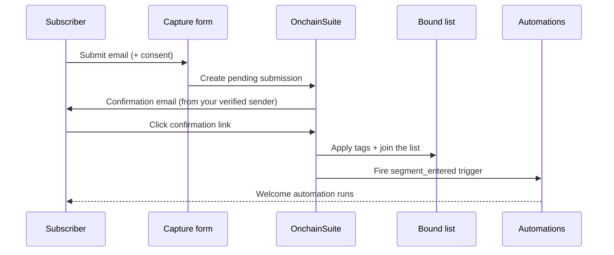

Capture forms are how email enters your workspace. A wallet-first audience has no email until someone gives it to you, with consent, and a capture form is the consent-first path: the subscriber supplies their own address, confirms it, and joins a list you've bound the form to.

<Note>
This is deliberate. The [server-to-server API](/integrations/server-api) refuses to accept an email attached to a wallet, a protocol asserting "wallet 0xABC is alice@example.com" is exactly the wallet-to-identity link the privacy model prevents. Email arrives through a form, from the subscriber, or not at all.
</Note>

## Double opt-in

When a form requires confirmation, a submission doesn't join the list right away. The subscriber first proves the address is theirs by clicking a link in a confirmation email. This is the flow that keeps your list clean and your sending reputation intact.

<Steps>
  <Step title="Submit">
    The subscriber submits the form with their email (and optionally a wallet address and custom fields). The submission is stored as **pending**, no list membership, no tags applied yet.
  </Step>
  <Step title="Confirm">
    A confirmation email is sent **from your organization's verified sender**, so it routes on your own sending domain rather than a platform default. It's a **branded email** in the same card layout as your other transactional mail, carrying your workspace logo and accent color (falling back to the platform look when you haven't set them). The email links to a hosted confirmation page.
  </Step>
  <Step title="Join">
    Clicking the link confirms the subscriber. Only now are the form's tags and **list membership applied**, the subscriber genuinely joins the bound list at confirmation, not at submission.
  </Step>
  <Step title="Trigger">
    Confirmation fires a `segment_entered` trigger for the bound list, so an automation can greet the new subscriber the moment they join. See [Triggers and conditions](/automation/triggers-and-conditions).
  </Step>
</Steps>

<Note>
Because tags and list membership are held until the click, a `segment_entered` automation on the bound list fires on genuine, confirmed subscribers only. An abandoned or unconfirmed submission never enters the list and never triggers the flow.
</Note>

The hosted confirmation page is a **branded card** in the same style as the email, your logo, accent color, and a "you're confirmed" message, or it redirects to the success URL you configured on the form. It carries a **"Powered by OnchainSuite"** footer where "OnchainSuite" links to [onchainsuite.com](https://onchainsuite.com). Expired or invalid confirmation links show a friendly message rather than a raw error. Confirmation links are single-use and valid for 14 days.

## Binding to a list

A form is bound to a list (a [segment](/audience/segments) you import into) when you create it. Every confirmed submission joins that list, which is what makes the form useful: the list feeds campaigns and automations like any other segment. A contact captured this way becomes **email-reachable**, and the [server-to-server API](/integrations/api-keys) will report it as reachable **without ever returning the address**.

### Every form lands in a list, automatically

<Note>
**Rolling out.** Auto-created form lists are shipping now; if a form you created earlier isn't showing its list yet, it's backfilled the next time a subscriber confirms.
</Note>

You no longer have to bind a list by hand. When a form **isn't** explicitly bound to one, OnchainSuite auto-creates a **List named after the form**, backed by a **tag of the same name**, and binds the form to it. So confirmed subscribers always land somewhere findable in [Audience](/audience/segments), under a list and a tag that match the form's name, with nothing to wire up.

The list is created the first time it's needed and reused after that. Confirming a double opt-in then does three things at once:

- **Adds the contact to that list** (the auto-created one, or the list you bound explicitly).
- **Tags the contact** with the list's backing tag (the form-named tag).
- **Fires the `segment_entered` trigger** for the list, so a [welcome automation](/automation/triggers-and-conditions) can greet the subscriber the moment they join.

Binding a list explicitly still works exactly as before and takes precedence, the auto-created list only kicks in when you didn't choose one.

## Submitting a form

There are two ways a submission reaches you:

- **Embedded on your site.** Drop the form onto your page and visitors fill it in themselves. Submissions are protected from spam and bots automatically, nothing to configure.
- **Fed from your backend.** If you already collect email somewhere else, a developer on your team can hand those submissions to the same form from your server. See the [server-side guide](/integrations/server-api#quickstart-ingest-a-capture) for the code.

Either way, the subscriber supplies their email and consent (and optionally a wallet address and custom fields). When the form requires confirmation, the submission is held as pending until they click the link.

## Reading submissions

You can view and page through a form's submissions in the dashboard. Every role can read them. Each row shows:

| What you see | Meaning |
| --- | --- |
| Status | `pending` (confirmation sent, not yet clicked), `confirmed` (double opt-in complete), or `subscribed` (single opt-in). |
| Custom fields | Whatever extra fields the form collected. |
| Wallet | A submitted wallet address, marked unverified because it's self-reported rather than a signed proof. |
| Source | Where it came from, your site or your backend. |
| Consent | Whether the subscriber agreed, and when. |

<Note>
The email address itself is never shown in the submissions list. You can see that someone is reachable and that they consented; the address stays protected. To actually message them, that's what their confirmed list membership is for.
</Note>
