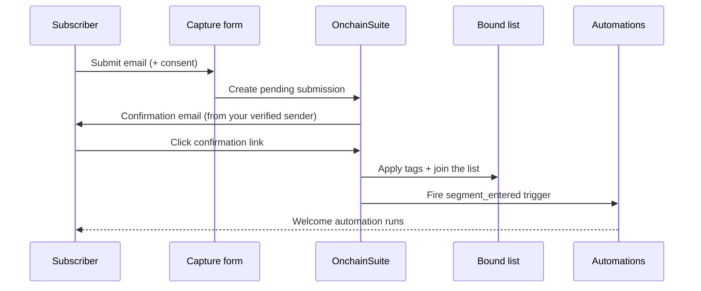

Capture forms are how email enters your workspace. A wallet-first audience has no email until someone gives it to you, with consent, and a capture form is the consent-first path: the subscriber supplies their own address, confirms it, and joins a list you've bound the form to.

<Note>
This is deliberate. The server-to-server [`POST /identify`](/integrations/api-keys#server-to-server-endpoints) refuses email and every other personal identifier, a protocol asserting "wallet 0xABC is alice@example.com" is exactly the wallet-to-identity link the privacy model prevents. Email arrives through a form, from the subscriber, or not at all.
</Note>

## Double opt-in

When a form requires confirmation, a submission doesn't join the list right away. The subscriber first proves the address is theirs by clicking a link in a confirmation email. This is the flow that keeps your list clean and your sending reputation intact.



<Steps>
  <Step title="Submit">
    The subscriber submits the form with their email (and optionally a wallet address and custom fields). The submission is stored as **pending**, no list membership, no tags applied yet.
  </Step>
  <Step title="Confirm">
    A confirmation email is sent **from your organization's verified sender**, so it routes on your own sending domain rather than a platform default. It's a **branded email** in the same card layout as your other transactional mail, carrying your workspace logo and accent color (falling back to the platform look when you haven't set them). The email links to a hosted confirmation page.
  </Step>
  <Step title="Join">
    Clicking the link confirms the subscriber. Only now are the form's tags and **list membership applied**, the subscriber genuinely joins the bound list at confirmation, not at submission.
  </Step>
  <Step title="Trigger">
    Confirmation fires a `segment_entered` trigger for the bound list, so an automation can greet the new subscriber the moment they join. See [Triggers and conditions](/automation/triggers-and-conditions).
  </Step>
</Steps>

<Note>
Because tags and list membership are held until the click, a `segment_entered` automation on the bound list fires on genuine, confirmed subscribers only. An abandoned or unconfirmed submission never enters the list and never triggers the flow.
</Note>

The hosted confirmation page is a **branded card** in the same style as the email, your logo, accent color, and a "you're confirmed" message, or it redirects to the success URL you configured on the form. It carries a **"Powered by OnchainSuite"** footer where "OnchainSuite" links to [onchainsuite.com](https://onchainsuite.com). Expired or invalid confirmation links show a friendly message rather than a raw error. Confirmation links are single-use and valid for 14 days.

## Binding to a list

A form is bound to a list (a [segment](/audience/segments) you import into) when you create it. Every confirmed submission joins that list, which is what makes the form useful: the list feeds campaigns and automations like any other segment. A contact captured this way becomes **email-reachable**, and the [server-to-server API](/integrations/api-keys) will report it as reachable **without ever returning the address**.

### Every form lands in a list, automatically

<Note>
**Rolling out.** Auto-created form lists are shipping now; if a form you created earlier isn't showing its list yet, it's backfilled the next time a subscriber confirms.
</Note>

You no longer have to bind a list by hand. When a form **isn't** explicitly bound to one, OnchainSuite auto-creates a **List named after the form**, backed by a **tag of the same name**, and binds the form to it. So confirmed subscribers always land somewhere findable in [Audience](/audience/segments), under a list and a tag that match the form's name, with nothing to wire up.

The list is created the first time it's needed and reused after that. Confirming a double opt-in then does three things at once:

- **Adds the contact to that list** (the auto-created one, or the list you bound explicitly).
- **Tags the contact** with the list's backing tag (the form-named tag).
- **Fires the `segment_entered` trigger** for the list, so a [welcome automation](/automation/triggers-and-conditions) can greet the subscriber the moment they join.

Binding a list explicitly still works exactly as before and takes precedence, the auto-created list only kicks in when you didn't choose one.

## Submitting a form

Forms can be embedded on your site (the browser posts to the public submit endpoint) or fed server-side from your own backend.

<Tabs>
  <Tab title="Public (browser)">
    ```http
    POST /api/v1/public/forms/{token}/submit
    ```

    Unauthenticated, protected by rate limiting, a honeypot field, and a Turnstile challenge. `{token}` is the form's public token. Body:

    ```json
    {
      "email": "alice@example.com",
      "walletAddress": "0xabc...",
      "fields": { "referral": "twitter" },
      "consent": true,
      "consentText": "I agree to receive product updates."
    }
    ```

    The submitter's `origin` is read from the request headers, not the body. A tripped honeypot returns `{ "ok": true }` silently.
  </Tab>
  <Tab title="Server-side (secret key)">
    ```http
    POST /api/v1/forms/{token}/ingest
    ```

    Authenticated with a **secret key** (`Authorization: Bearer sk_live_…` or `x-secret-key: sk_live_…`). The key's organization must own the form. Same body as the public submit, minus the honeypot and Turnstile. See the [server-side integration guide](/integrations/server-api#quickstart-ingest-a-capture).
  </Tab>
</Tabs>

Both return `{ "ok": true, ... }`; when confirmation is required the response indicates a pending confirmation rather than an immediate join.

## Reading submissions

Back your own dashboard with the paginated submissions endpoint.

```http
GET /api/v1/forms/{id}/submissions
```

Session-authenticated, org-scoped. Any role (Owner, Admin, Editor, Viewer).

<ParamField query="page" type="integer" default="1">
  1-based page number.
</ParamField>

<ParamField query="limit" type="integer" default="25">
  Rows per page, clamped to 1–100.
</ParamField>

Response:

```json
{
  "items": [
    {
      "id": "sub_abc",
      "walletAddress": "0xabc...",
      "walletVerified": false,
      "values": { "referral": "twitter" },
      "source": "public",
      "consent": true,
      "status": "confirmed",
      "zkProtected": true,
      "createdAt": "2026-08-28T12:00:00.000Z"
    }
  ],
  "total": 1240,
  "page": 1,
  "limit": 25
}
```

| Field | Meaning |
| --- | --- |
| `status` | `pending` (confirmation sent, not yet clicked), `confirmed` (double opt-in complete), or `subscribed` (single opt-in). |
| `values` | The submitted custom fields, with email keys stripped out. |
| `walletVerified` | Always `false`, a submitted wallet address is self-reported, not a signed proof. |
| `zkProtected` | Whether the submission was stored under the workspace's privacy protection. |
| `source` | Where it came from (`public`, `api`, …). |

<Note>
The email address itself is never returned in the submissions list. Reachability and consent are reported; the address stays protected. To collect an address you can message, that's what the confirmed list membership is for.
</Note>
