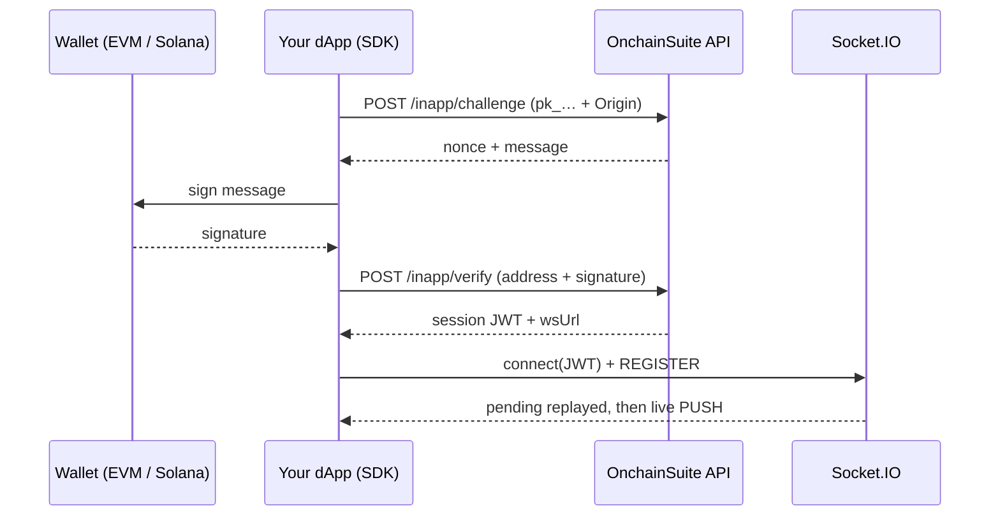

Deliver notifications to your users addressed by **wallet address**, no email, no phone number, no account system required. A user proves ownership of their wallet by signing a message, and from then on you can reach them wherever they are.

One send reaches the user through whichever channel they're reachable on:

<CardGroup cols={3}>
  <Card title="In-app" icon="bell">
    A live toast in your dApp while the page is open, over a Socket.IO connection.
  </Card>
  <Card title="Web push" icon="browser">
    An OS notification when the tab is closed, via a service worker.
  </Card>
  <Card title="Mobile push" icon="mobile">
    APNs and FCM delivery to your iOS and Android apps.
  </Card>
</CardGroup>

The SDK gives you all three plus wallet auth and a styled toast UI; a server-to-server API sends pushes from your backend with a secret key.

## How it works

<Steps>
  <Step title="Allow your origin">
    Register your frontend's origin in the dashboard. Requests from anywhere else are rejected.
  </Step>
  <Step title="Wallet authenticates">
    The browser requests a challenge with your **publishable key**, the wallet signs it, and the server returns a short-lived session token. The wallet can be **EVM or Solana**, the server verifies both.
  </Step>
  <Step title="Client connects">
    The client opens a Socket.IO connection with that token and joins a room scoped to its org + wallet. Optionally it also registers for web or mobile push.
  </Step>
  <Step title="You send pushes">
    From your backend (secret key), a campaign, or an automation. The platform routes each one to a live socket if the user is connected, otherwise to web or mobile push, otherwise it's held and replayed on reconnect.
  </Step>
</Steps>



### Wallets it works with

The SDK **auto-discovers** the wallets installed in the browser and authenticates whichever the user picks:

- **EVM** wallets are discovered via [EIP-6963](https://eips.ethereum.org/EIPS/eip-6963) multi-wallet announcement, with a `window.ethereum` fallback. Signing uses EIP-191 `personal_sign`.
- **Solana** wallets (Phantom, Solflare, Backpack, Glow, Coinbase) are discovered by scanning their standard injection points. Signing uses ed25519, and the signature is sent base58-encoded.

The server verifies both. Which scheme runs is chosen from the address shape (`0x…` → EVM, otherwise Solana), so you don't configure a chain. To take over signing entirely, for either chain, pass a [`signMessage` override](#bring-your-own-signer).

<Note>
The platform never sends a live in-app toast **and** an OS push for the same notification. If the wallet has an open socket, only the toast fires. When the socket is closed, web and mobile push take over. Cross-channel duplicates are collapsed by delivery ID, so tapping an OS push and then opening your dApp won't show the same notification twice.
</Note>

## Keys and environments

| Key | Where it lives | What it does |
| --- | --- | --- |
| `pk_live_*` / `pk_test_*` | Browser, safe to ship publicly | Challenge/verify wallet auth only |
| `sk_live_*` / `sk_test_*` | Server only, never in client code | Send pushes programmatically |

Your publishable key's environment decides which allowed origins apply:

- `pk_live_*` matches origins registered as **`production`**
- `pk_test_*` matches origins registered as **`development`**

<Warning>
The origins API also accepts `staging`, but no publishable key ever resolves to it. An origin registered as `staging` will never match any key, use `production` or `development`.
</Warning>

<Note>
The in-app allowlist is separate from the API's CORS allowlist. Your origin must be present in **both** for browser requests to succeed. If you get a CORS error in the console rather than an `Origin not allowed` response body, it's the CORS allowlist that's missing your domain.
</Note>

## Quickstart with the SDK

The fastest path is the official browser SDK. It handles the challenge/verify handshake, the socket lifecycle, reconnection, delivery reporting, and an optional toast UI.

<CodeGroup>
```bash npm
npm i @onchainsuite/sdk@latest
```

```html CDN loader
<!-- inapp.js bundles socket.io and auto-starts from data-* attributes -->
<script
  src="https://cdn.jsdelivr.net/npm/@onchainsuite/sdk@latest/dist/inapp.js"
  data-key="pk_live_yourorg_xxx"
  data-api="https://api.onchainsuite.com"
  data-autostart></script>
```

```html CDN (ESM)
<!-- ESM import: load socket.io-client first so the SDK finds window.io -->
<script src="https://cdn.socket.io/4.8.3/socket.io.min.js"></script>
<script type="module">
  import { OnchainSuite } from "https://esm.sh/@onchainsuite/sdk@latest";

  const os = new OnchainSuite("pk_live_yourorg_xxx", {
    apiBaseUrl: "https://api.onchainsuite.com",
  });
  await os.start();
</script>
```
</CodeGroup>

<Note>
Three ways in, pick one:

- **npm / bundler** — `import { OnchainSuite } from "@onchainsuite/sdk"`. The bundled `socket.io-client` is pulled in automatically, nothing else to install.
- **CDN loader (`inapp.js`)** — a self-contained IIFE bundle (socket.io included). Add `data-key` and it constructs a client on `window.onchainsuite`; add `data-autostart` and it calls `start()` for you. Optional `data-api` sets the API base (defaults to `https://api.onchainsuite.com`). No import, no build step. Only ever put a **`pk_…`** key here, never `sk_…`.
- **CDN (ESM)** — a raw `esm.sh` import can't supply the bundled socket.io, so load `socket.io-client` first (the SDK finds it on `window.io`), or inject your own with the `ioClient` option.
</Note>

The SDK is ESM-only and tree-shakeable.

### Simplest integration

```ts
import { OnchainSuite } from "@onchainsuite/sdk";

const os = new OnchainSuite("pk_live_yourorg_xxx", {
  apiBaseUrl: "https://api.onchainsuite.com",
});

await os.start(); // prompts window.ethereum to connect + sign
```

That's the whole integration. `start()` auto-discovers the browser's installed wallet, EVM via EIP-6963 (falling back to `window.ethereum`), or Solana via its standard injection, runs the signature handshake, connects the socket, and begins rendering notifications. Pass an address to `start(walletAddress)` to pin a specific account.

### Bring your own signer

If your app already manages wallet connection, pass a signer and the address explicitly so the user isn't prompted twice.

```ts
const os = new OnchainSuite("pk_live_yourorg_xxx", {
  apiBaseUrl: "https://api.onchainsuite.com",
  signMessage: async (message) => signMessageAsync({ message }),
});

await os.start(walletAddress);
```

`signMessage` is the **universal override**: `(message, walletAddress) => Promise<string>`. When you supply it, the SDK never touches the wallet itself, so it works for **any** wallet on **either** chain, an EVM signer from wagmi/viem/ethers, or a Solana wallet's `signMessage`. Return the signature your wallet produces (hex for EVM, base58 for Solana). Without the override, the SDK signs with the discovered wallet automatically.

### React

```tsx
import { useEffect } from "react";
import { OnchainSuite } from "@onchainsuite/sdk";

useEffect(() => {
  if (!address) return;

  const os = new OnchainSuite("pk_live_yourorg_xxx", {
    apiBaseUrl: "https://api.onchainsuite.com",
    signMessage: async (message) => signMessageAsync({ message }),
  });

  os.start(address);
  return () => os.stop(); // always clean up on unmount / disconnect
}, [address]);
```

### Custom rendering

Return `false` from `onNotification` to suppress the built-in toast while keeping delivery analytics intact, then render the notification however you like.

```ts
const os = new OnchainSuite("pk_live_yourorg_xxx", {
  apiBaseUrl: "https://api.onchainsuite.com",
  display: false, // disable built-in UI entirely
  onNotification: (n) => {
    myToastLibrary.show({ title: n.title, body: n.body, href: n.cta?.url });
    return false;
  },
});

os.on("connected", () => console.log("live"));
os.on("error", (e) => console.warn(e));

await os.start();
```

Report interactions yourself when you render your own UI, so click and view analytics stay accurate:

```ts
os.report(notification, "clicked");
```

### SDK reference

<ParamField path="publishableKey" type="string" required>
  Must start with `pk_`. The constructor throws otherwise.
</ParamField>

<ParamField path="options.apiBaseUrl" type="string">
  API origin **without** the `/api/v1` suffix, e.g. `https://api.onchainsuite.com`.
</ParamField>

<ParamField path="options.signMessage" type="(message: string, walletAddress: string) => Promise<string>">
  Custom signer, receiving the challenge message and the wallet address. Defaults to `personal_sign` via `window.ethereum`.
</ParamField>

<ParamField path="options.provider" type="EIP1193Provider">
  Explicit wallet provider instead of `window.ethereum`.
</ParamField>

<ParamField path="options.display" type="DisplayOptions | false">
  Toast configuration, or `false` to disable the built-in UI.
</ParamField>

<ParamField path="options.onNotification" type="(n, actions) => boolean | void">
  Called per notification. Return `false` to suppress the built-in toast. `actions` provides `report(type)`, `click()`, and `dismiss()`.
</ParamField>

<ParamField path="options.ioClient" type="io factory">
  Inject your own `socket.io-client` instead of the bundled one, useful on the CDN path or to pin a version.
</ParamField>

<ParamField path="options.push" type="false | { serviceWorkerPath?: string }">
  Web push configuration. Defaults to enabled with the service worker at `/onchainsuite-sw.js`. Set to `false` to disable web push entirely. See [Web push](#web-push).
</ParamField>

<ParamField path="options.debug" type="boolean">
  Verbose console logging.
</ParamField>

You can also construct the client with `createClient(publishableKey, options)`, a functional alias for `new OnchainSuite(...)`.

**Display defaults:** `position: "bottom-right"`, `accent: "#6d5efc"`, `background: "#111318"`, `foreground: "#f5f6f8"`, `duration: 8000` (use `0` for sticky), `maxVisible: 3`, `zIndex: 2147483000`.

**Methods:**

| Method | Purpose |
| --- | --- |
| `start(walletAddress?)` | Authenticate the wallet and connect. |
| `stop()` | Disconnect and tear down. |
| `on(event, cb)` | Subscribe; returns an unsubscribe function. |
| `report(notification, type)` | Report an interaction (`delivered`, `viewed`, `dismissed`, `clicked`). |
| `enablePush()` | Prompt for and register web push. Returns the resulting `PushStatus`. |
| `disablePush()` | Unregister web push for this device. |
| `pushStatus()` | Current web-push permission, `"unsupported" \| "denied" \| "prompt" \| "granted"`. No prompt. |
| `registerDevice(token, platform, appId?)` | Register a mobile device token (`platform` is `"ios"` or `"android"`). |
| `unregisterDevice(token)` | Remove a mobile device token. |

**Events:** `"notification"`, `"connected"`, `"disconnected"`, `"error"`.

Behaviour worth knowing: `delivered` is reported automatically on receipt; the socket reconnects indefinitely with backoff from 1s to 15s; toast content is rendered with `textContent`, so notification text can't inject HTML; and `start()` resolves after 8 seconds even if the socket hasn't connected yet, so it never hangs your boot sequence.

## Web push

Web push delivers an **OS-level notification when your dApp's tab is closed**, the same notifications, reaching users who've navigated away. It needs a service worker and the user's permission.

<Steps>
  <Step title="Host the service worker">
    The SDK ships one at `node_modules/@onchainsuite/sdk/public/onchainsuite-sw.js`. Copy it to your site root so it's served at `/onchainsuite-sw.js`.

    Already have a service worker? Import ours into it instead:

    ```js
    // your-sw.js
    importScripts("/onchainsuite-sw.js");
    ```

    Point the SDK at a custom path with `push: { serviceWorkerPath: "/my-sw.js" }`.
  </Step>

  <Step title="Prompt from a user action">
    Call `enablePush()` in response to a click, not on load, so the permission prompt has context. Gate it on `pushStatus()` so you don't re-prompt someone who already decided.

    ```ts
    const client = createClient("pk_live_yourorg_xxx", {
      apiBaseUrl: "https://api.onchainsuite.com",
    });
    await client.start();

    if (client.pushStatus() === "prompt") {
      const status = await client.enablePush(); // "granted" | "denied" | ...
    }
    ```
  </Step>
</Steps>

The SDK fetches the platform VAPID key, registers the subscription with the server, and re-syncs a granted subscription automatically on every `start()`. There's no VAPID key for you to configure. Turn it off per user with `disablePush()`, or disable the feature entirely with `push: false`.

## Mobile push

For a native iOS or Android app, register the device's push token after `start()`. The SDK doesn't fetch the token, obtain it with your own push library (`expo-notifications`, `@react-native-firebase/messaging`, etc.) and hand it over.

```ts
import messaging from "@react-native-firebase/messaging";

await client.start(walletAddress);
await messaging().requestPermission();

const token = await messaging().getToken();
await client.registerDevice(token, "android");

// Keep it fresh; tokens rotate.
messaging().onTokenRefresh((t) => client.registerDevice(t, "android"));
```

Use `"ios"` for APNs. Stop delivery to one device with `unregisterDevice(token)`.

<Note>
Mobile push requires your Apple (APNs `.p8`) or Firebase (FCM service account) credentials on file, an OWNER or ADMIN uploads them once in the dashboard under organization push credentials. Without them, device tokens register but nothing is delivered.
</Note>

## Choosing a channel is automatic

You don't pick the channel, the platform routes each notification per recipient:

| Recipient state | Delivery |
| --- | --- |
| Socket connected | In-app toast only |
| No socket, has push registered | Web and/or mobile push |
| Neither | Held, replayed on next connect |

A wallet with both a browser subscription and a phone can receive both. What never happens is a live toast and an OS push for the same notification. `deliveredNow: false` on a send is still not an error. It means the user wasn't socket-connected on the node that handled the request, and OS push or replay takes over.

## Dashboard setup

These endpoints back your own dashboard UI and use a cookie session plus an org role. Base path: `https://api.onchainsuite.com/api/v1`.

<AccordionGroup>
  <Accordion title="GET /integrations/inapp/status" icon="circle-info">
    Requires `OWNER` or `ADMIN`. Returns publishable keys, secret key metadata, live session count, daily usage, and origin count.

    ```json
    {
      "active": true,
      "protocolId": "<organizationId>",
      "publishableKeys": { "production": "pk_live_…", "test": "pk_test_…" },
      "secretKeys": [
        { "id": "…", "environment": "live", "name": "backend", "createdAt": "…",
          "lastUsedAt": "…", "revokedAt": null, "prefix": "sk_live_…" }
      ],
      "activeSessions": 12,
      "dailyUsage": { "used": 431, "limit": 50000, "percentage": 0.86, "resetsAt": "…" },
      "allowedOriginsCount": 2
    }
    ```
  </Accordion>

  <Accordion title="GET /integrations/inapp/origins" icon="list">
    Requires `OWNER` or `ADMIN`.

    ```json
    [
      { "id": "…", "origin": "https://app.example.com",
        "environment": "production", "createdAt": "…" }
    ]
    ```
  </Accordion>

  <Accordion title="POST /integrations/inapp/origins" icon="plus">
    Requires `OWNER` or `ADMIN`. Both fields required; `environment` must be `production`, `staging`, or `development`.

    ```json
    { "origin": "https://app.example.com", "environment": "production" }
    ```

    The origin is normalized to scheme + host + port, any path is stripped. Registering the same origin twice in one environment returns `400 Origin already exists for this environment`.
  </Accordion>

  <Accordion title="DELETE /integrations/inapp/origins/{originId}" icon="trash">
    Requires `OWNER` or `ADMIN`. Returns `{ "deleted": true }`.
  </Accordion>

  <Accordion title="POST /integrations/inapp/test-push" icon="paper-plane">
    Requires `OWNER`, `ADMIN`, or `EDITOR`. `walletAddress`, `title`, and `body` are required; `ctaLabel` and `ctaUrl` optional.

    Test pushes don't count against your plan's message allowance, but they **do** count toward the daily in-app quota.
  </Accordion>
</AccordionGroup>

## Response format

Every successful response is wrapped in a standard envelope. The examples below show the contents of `data`.

```json
{
  "success": true,
  "message": "Request processed successfully",
  "data": { },
  "timestamp": "2026-07-19T12:00:00.000Z",
  "requestId": "…"
}
```

Errors use a parallel shape:

```json
{
  "success": false,
  "error": { "code": "UNAUTHORIZED", "message": "Origin not allowed", "details": {} },
  "meta": { "timestamp": "…", "path": "/api/v1/inapp/challenge", "requestId": "…" }
}
```

Error codes by status: `400 BAD_REQUEST`, `401 UNAUTHORIZED`, `403 FORBIDDEN`, `404 NOT_FOUND`, `409 CONFLICT`, `422 VALIDATION_ERROR`, `429 RATE_LIMITED`, `500 INTERNAL_ERROR`.

## Manual browser integration

Use this if you're not on JavaScript or need to control the handshake yourself. Otherwise prefer the SDK above.

### Step 1, Request a challenge

`POST /api/v1/inapp/challenge`

Send `x-publishable-key: pk_live_…` (or `Authorization: Bearer pk_live_…`) and an `Origin` header matching an allowed origin.

```json
{ "walletAddress": "0xabc..." }
```

`data`:

```json
{
  "nonceId": "f3c1…",
  "message": "OnchainSuite In-App Push\n\nWallet: 0xabc…\nNonce: …\nIssued At: …\nExpires At: …",
  "expiresAt": "2026-07-19T12:05:00.000Z"
}
```

The challenge is valid for **5 minutes**.

### Step 2, Sign and verify

For an **EVM** wallet, sign the returned `message` with EIP-191 `personal_sign`:

```ts
import { BrowserProvider } from "ethers";

const provider = new BrowserProvider(window.ethereum);
const signer = await provider.getSigner();
const signature = await signer.signMessage(message);
```

For a **Solana** wallet, sign the UTF-8 bytes of the same `message` with ed25519 and send the signature **base58-encoded**:

```ts
import bs58 from "bs58";

const { signature } = await window.solana.signMessage(
  new TextEncoder().encode(message),
);
const signatureB58 = bs58.encode(signature);
```

The server picks the verification scheme from the address shape (`0x…` → EVM, otherwise Solana), so send the address and signature exactly as your wallet produced them.

`POST /api/v1/inapp/verify` with the same headers:

```json
{ "walletAddress": "0xabc...", "signature": "0x..." }
```

`data`:

```json
{
  "token": "<session-jwt>",
  "wsUrl": "https://api.onchainsuite.com/api/v1/inapp/register",
  "expiresAt": "2026-07-26T12:00:00.000Z"
}
```

<Note>
`wsUrl` is built from the incoming request's host, so always use the returned value rather than hardcoding it.
</Note>

Both `/inapp/challenge` and `/inapp/verify` are rate limited to **3 requests per 10 seconds**.

### Step 3, Connect the socket

Connect Socket.IO at path `/api/v1/inapp/register`. The token can go in `handshake.auth.token`, an `Authorization: Bearer` header, or a `?t=` query param.

```ts
import { io } from "socket.io-client";

const socket = io("https://api.onchainsuite.com", {
  path: "/api/v1/inapp/register",
  transports: ["websocket"],
  auth: { token },
});

socket.on("connect", () => {
  socket.emit("REGISTER", { walletAddress }, (ack) => {
    console.log(`connected, ${ack.pendingCount} pending`);
  });
});

socket.on("PUSH", (push) => {
  renderNotification(push);
  socket.emit("EVENT", {
    campaignRunId: push.campaignRunId,
    deliveryId: push.deliveryId,
    type: "delivered",
  });
});
```

Pending notifications are replayed automatically on connect, before any live pushes arrive.

#### Socket events

**Server → client**, `PUSH`:

```ts
{
  deliveryId: string;
  campaignRunId: string;
  walletAddress: string;
  title: string;
  body: string;
  cta?: { label: string; url: string };
  createdAt: string;
  expiresAt: string;
  deliveredAt?: string;  // present on replay
  viewedAt?: string;
}
```

**Client → server:**

| Event | Payload | Ack |
| --- | --- | --- |
| `REGISTER` | `{ walletAddress }` | `{ ok: true, pendingCount }` |
| `EVENT` | `{ campaignRunId, deliveryId, type, walletAddress?, metadata? }` | `{ ok: true }` |

`type` is one of `delivered`, `viewed`, `dismissed`, or `clicked`. Optional `metadata` is stored on the delivery record.

<Warning>
Reporting events for a wallet other than the one in your session token disconnects the socket immediately. There is no error event. It surfaces client-side as `disconnect` or `connect_error`.
</Warning>

## Sending pushes from your backend

`POST /api/v1/inapp/push` with `Authorization: Bearer sk_…` (or `x-secret-key: sk_…`). The organization is derived from the key.

```bash
curl -X POST https://api.onchainsuite.com/api/v1/inapp/push \
  -H "Authorization: Bearer sk_live_…" \
  -H "Content-Type: application/json" \
  -d '{
    "walletAddress": "0xabc...",
    "title": "You received tokens",
    "body": "A transfer just hit your wallet.",
    "ctaLabel": "View transaction",
    "ctaUrl": "https://app.example.com/tx/0x...",
    "automationId": "transfer_alert"
  }'
```

<ParamField path="walletAddress" type="string" required>
  Recipient wallet.
</ParamField>

<ParamField path="title" type="string">
  Required unless supplied by `templateId`.
</ParamField>

<ParamField path="body" type="string">
  Required unless supplied by `templateId`.
</ParamField>

<ParamField path="templateId" type="string">
  An in-app template to render. Its `content.channel` must be `"inapp"`.
</ParamField>

<ParamField path="variables" type="Record<string, string>">
  Merge values for `{{ token }}` placeholders. Max 50 entries.
</ParamField>

<ParamField path="ctaLabel" type="string">
  Button label. Only renders when `ctaUrl` is also present.
</ParamField>

<ParamField path="ctaUrl" type="string">
  Button destination.
</ParamField>

<ParamField path="automationId" type="string">
  Free-form tag for attribution. Defaults to `inapp_api`.
</ParamField>

`data`:

```json
{
  "ok": true,
  "campaignRunId": "…",
  "deliveryId": "…",
  "deliveredNow": true,
  "expiresAt": "2026-07-22T12:00:00.000Z"
}
```

<Warning>
`deliveredNow` is a best-effort signal meaning "a socket for this wallet is connected to the node that handled your request." A `false` does **not** mean the push failed; the user may be connected to another node, and offline users get the push replayed on reconnect. For authoritative delivery, read the `delivered` event in your analytics.
</Warning>

### Templates and merge variables

When you send `templateId`, these variables are always available without you supplying them:

| Variable | Value |
| --- | --- |
| `wallet`, `wallet_address`, `walletAddress` | Full recipient address |
| `wallet_short` | Truncated form, e.g. `0xabcd…1234` |

Unknown placeholders are left in the text as-is rather than blanked, which makes typos visible during testing.

### Sending to many wallets

There is no bulk endpoint on the secret-key API, loop `/inapp/push` per wallet. For audience-scale sends, use one of these instead:

- **Campaign to a segment**, `POST /api/v1/campaigns/{id}/send-inapp` resolves recipients from the campaign's segment and returns `{ campaignRunId, recipientCount, deliveredNowCount, skippedCount }`. Optional body fields `title`, `body`, `ctaLabel`, `ctaUrl` override the campaign's stored content.
- **Automations**, add a `send_inapp` step and let the workflow resolve the audience.

To preview reach before sending, query your segment with `?reachable_on=inapp`.

<Tip>
To trigger a push from something that happens in **your product**, a signup, a deposit, a status change, send a [custom event](/integrations/custom-events) and let an automation turn it into a push. See the [end-to-end walkthrough](/integrations/custom-events#end-to-end-notify-a-user-from-an-offchain-event).
</Tip>

## Limits and quotas

| Limit | Value |
| --- | --- |
| Push TTL | 72 hours |
| Pending notifications per wallet | 10 most recent |
| Challenge TTL | 5 minutes |
| Session token TTL | 7 days (configurable, 10 minutes to 30 days) |
| Challenge/verify rate limit | 3 requests per 10 seconds |
| Daily pushes per organization | 50,000 (UTC day) |

Expired, dismissed, and clicked notifications are pruned and never replayed.

In-app pushes have their **own monthly allowance**, separate from email. Exceeding it returns `402 PLAN_LIMIT_EXCEEDED`; warnings fire at 75% and 95% of the allowance. Exceeding the daily cap returns `429 Daily in-app push quota exceeded`. See [Plans and billing](/settings/plans-and-billing) for the per-plan numbers.

<Note>
Rate-limit (429) responses from the throttler return a flat body, `{ statusCode, message, error, retryAfter, limit, remaining, resetAt, path, timestamp }`, rather than the standard error envelope, along with `X-RateLimit-Limit` and `X-RateLimit-Remaining` headers.
</Note>

## Troubleshooting

<AccordionGroup>
  <Accordion title="401 Origin not allowed" icon="ban">
    - The `Origin` header must match a registered origin exactly: scheme, host, **and** port.
    - Confirm the key environment lines up, `pk_live_*` only matches `production` origins, `pk_test_*` only matches `development`.
    - An origin saved as `staging` never matches anything. Re-register it.
  </Accordion>

  <Accordion title="401 Invalid publishable key / Missing publishable key" icon="key">
    Send the key as `x-publishable-key` or `Authorization: Bearer`. Check you haven't shipped a test key to production.
  </Accordion>

  <Accordion title="401 Signature does not match wallet" icon="signature">
    Sign the `message` string exactly as returned, no trimming or re-encoding, using EIP-191 `personal_sign`. Also confirm `walletAddress` in the verify call matches the signing account.
  </Accordion>

  <Accordion title="401 Challenge not found or expired" icon="clock">
    Challenges live 5 minutes and are single-use. Request a fresh one rather than retrying an old signature.
  </Accordion>

  <Accordion title="Notifications never arrive" icon="wifi">
    - Confirm the socket is connected and listening for `PUSH` (not a custom event name).
    - Check the path is exactly `/api/v1/inapp/register`.
    - Check the send response, a `402` or `429` means it was never queued.
    - Remember that `deliveredNow: false` is normal and not an error.
  </Accordion>

  <Accordion title="Socket disconnects immediately" icon="plug">
    Almost always a wallet mismatch: the wallet in `REGISTER` or `EVENT` differs from the one in the session token. Re-run the handshake after a wallet switch.
  </Accordion>

  <Accordion title="CTA button doesn't render" icon="link-slash">
    Both `ctaLabel` and `ctaUrl` must be present. A label without a URL is dropped silently.
  </Accordion>

  <Accordion title="Real-time works locally but not in production" icon="server">
    Multi-instance deployments need `REDIS_URL` set so the Socket.IO Redis adapter can broadcast across nodes. Without it, live delivery only reaches users connected to the same instance, replay on reconnect still works, so the symptom is delayed rather than missing notifications.
  </Accordion>
</AccordionGroup>
