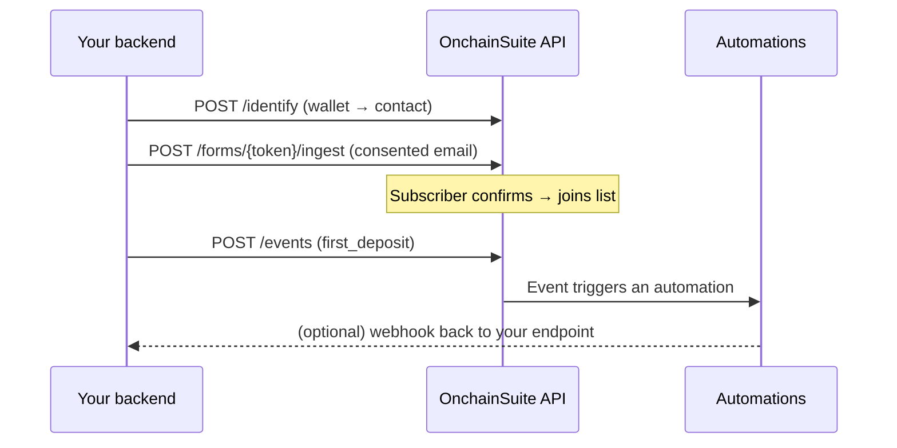

The server-side API is HTTP from **your backend**, authenticated with a secret (`sk_…`) key. Use it to register wallets as contacts, ingest form submissions, send pushes, and launch campaigns, everything that reads or writes data.

<Warning>
Secret keys are **server-only**. They grant full server-to-server access to your workspace, so never ship one to a browser, a mobile app, a repo, or any client. Client code uses a publishable (`pk_…`) key, which can only run the [wallet auth handshake](/integrations/in-app-notifications). If a secret key is ever exposed, [roll it](/integrations/api-keys#rolling-a-key) with zero grace immediately.
</Warning>

## Authentication

Every call carries your secret key in a header. Two forms are accepted, use whichever your HTTP client makes easy:

```
Authorization: Bearer sk_live_…
```

or

```
x-secret-key: sk_live_…
```

The organization is derived from the key, you never pass an org id. Base path:

```
https://api.onchainsuite.com/api/v1
```

<Note>
A `sk_test_…` key runs against your workspace in **test mode**, which is the safe way to integrate before going live, custom events sent with a test key are dry-run, for example. Read-only keys reject writes with `403`. See [API keys](/integrations/api-keys) for scopes, rolling, and revocation.
</Note>

## Quickstart: ingest a capture

The highest-value first call for most backends: hand a consented email (and optional wallet) to a [capture form](/audience/capture-forms) from your server. If the form uses double opt-in, this kicks off the confirmation email; on confirmation the contact joins the bound list and can fire an automation.

<CodeGroup>
```bash curl
curl -X POST https://api.onchainsuite.com/api/v1/forms/{token}/ingest \
  -H "Authorization: Bearer sk_live_…" \
  -H "Content-Type: application/json" \
  -d '{
    "email": "alice@example.com",
    "walletAddress": "0xabc...",
    "consent": true,
    "consentText": "I agree to receive product updates.",
    "fields": { "referral": "partner-app" }
  }'
```

```ts Node (fetch)
const res = await fetch(
  `https://api.onchainsuite.com/api/v1/forms/${token}/ingest`,
  {
    method: "POST",
    headers: {
      Authorization: `Bearer ${process.env.ONCHAIN_SECRET_KEY}`,
      "Content-Type": "application/json",
    },
    body: JSON.stringify({
      email: "alice@example.com",
      walletAddress: "0xabc...",
      consent: true,
      consentText: "I agree to receive product updates.",
      fields: { referral: "partner-app" },
    }),
  },
);

const data = await res.json(); // { ok: true, ... }
```

```python Python (requests)
import os, requests

res = requests.post(
    f"https://api.onchainsuite.com/api/v1/forms/{token}/ingest",
    headers={"Authorization": f"Bearer {os.environ['ONCHAIN_SECRET_KEY']}"},
    json={
        "email": "alice@example.com",
        "walletAddress": "0xabc...",
        "consent": True,
        "consentText": "I agree to receive product updates.",
        "fields": {"referral": "partner-app"},
    },
)
res.raise_for_status()
data = res.json()  # { "ok": True, ... }
```
</CodeGroup>

The key's organization must own the form (`{token}` is the form's token), or the request 404s. See [capture forms](/audience/capture-forms#submitting-a-form) for the body fields and the confirmation flow.

## The server-to-server surface

A secret key unlocks a small, deliberate set of endpoints. Reads never expose the email address itself.

| Endpoint | Purpose |
| --- | --- |
| `POST /identify` | Register a **wallet** as a contact. Wallet addresses only, PII is rejected. |
| `POST /forms/{token}/ingest` | Ingest a consented capture (email/wallet) into a bound list. |
| `POST /events` | Send a [custom product event](/integrations/custom-events) (signup, deposit, upgrade). |
| `POST /inapp/push` | Send a [wallet-addressed in-app push](/integrations/in-app-notifications#sending-pushes-from-your-backend). |
| `GET /contacts` | List contacts with reachability flags and tags. Never returns the email. |
| `GET /messages/pending?wallet=` | Fetch queued in-app pushes for one wallet. |
| `POST /campaigns/{id}/send` | Launch a campaign you've prepared in the dashboard. |

<Note>
Email can't be set through `POST /identify`, by design. The only consent-first path for an address is a [capture form](/audience/capture-forms), embedded or ingested server-side with the endpoint above.
</Note>

A few semantics worth knowing before you wire these up:

- **`POST /identify`** is idempotent on the wallet, lower-cases the address, and rejects any personal identifier (`email`, `phone`, `name`) with `400 PERSONAL_IDENTIFIER_REJECTED`. To attach traits, send a custom event instead.
- **`POST /campaigns/{id}/send`** takes a **prepared campaign id**, not the `campaignRunId` returned by `/inapp/push`. It can't compose or retarget; it launches what's already in the dashboard.
- **`GET /events/catalog`** is a dashboard (session) route, not a secret-key one, so a `sk_` key gets `401` there.

## Wrap it once

Keep the secret key in one server-only module and expose your own thin routes, so the key never reaches the browser.

```ts
// lib/onchain.server.ts (SERVER ONLY). Never import into a "use client" file.
const OCS = "https://api.onchainsuite.com/api/v1";
const SK = process.env.ONCHAIN_SECRET_KEY!; // sk_live_… (server env, not NEXT_PUBLIC)

async function ocs(path: string, body?: unknown, method = "POST") {
  const res = await fetch(OCS + path, {
    method,
    headers: { Authorization: `Bearer ${SK}`, "Content-Type": "application/json" },
    body: body ? JSON.stringify(body) : undefined,
    cache: "no-store",
  });
  const json = await res.json().catch(() => ({}));
  if (!res.ok) throw new Error(`OCS ${res.status} ${JSON.stringify(json)}`);
  return json;
}

// event: ^[a-z0-9_.:-]{1,64}$ ; contact needs >= 1 of walletAddress / email / externalId
export const identify = (walletAddress: string) => ocs("/identify", { walletAddress });
export const track = (event: string, walletAddress: string, payload?: object) =>
  ocs("/events", { event, contact: { walletAddress }, payload });
export const pushInApp = (walletAddress: string, title: string, body: string) =>
  ocs("/inapp/push", { walletAddress, title, body });
```

Call it from your own endpoint so the browser only ever talks to your server:

```ts
// app/api/track/route.ts
import { NextRequest, NextResponse } from "next/server";
import { track } from "@/lib/onchain.server";

export const runtime = "nodejs";

export async function POST(req: NextRequest) {
  const { event, walletAddress, payload } = await req.json();
  try {
    return NextResponse.json(await track(event, walletAddress, payload));
  } catch (e) {
    return NextResponse.json({ error: String(e) }, { status: 502 });
  }
}
```

## The shape of a backend integration



Register wallets as contacts, collect email through a form, with consent, then send product events and let campaigns and automations operate on the result. To hear about what happens next, delivered, viewed, unsubscribed, register a [webhook](/api/webhooks).

## Errors

Responses use the standard envelope. Common statuses:

| Status | Meaning |
| --- | --- |
| `401` | Missing, invalid, or revoked secret key. Send it as `Authorization: Bearer` or `x-secret-key`. |
| `403` | The key is **read-only** and the route writes. Use a read/write key. |
| `404` | The resource isn't in the key's organization (e.g. a form token owned by another workspace). |
| `429` | Rate limited, back off and retry. |
